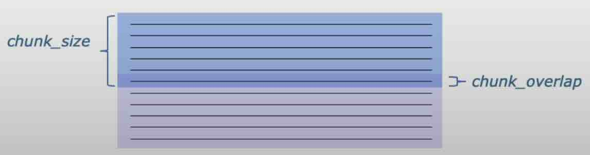
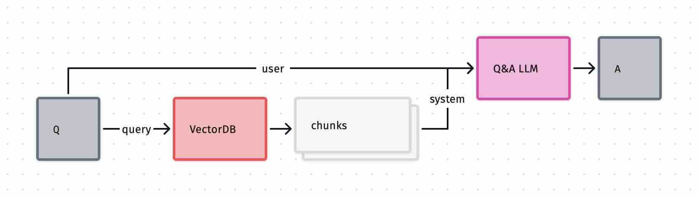

[back](../README.md)

{{TOC}}

# Stages of retrieval augmented generation

## (1) Document loading

Large Language Models (LLMs) primarily work with text data. To prepare documents for LLMs, LangChain provides over 80 document loaders that can transform various file types, including videos, into **plain text** + **metadata**. It's crucial to inspect the loaded data to ensure proper formatting and estimate appropriate chunk sizes. The loading process consists of two steps: first, the document is loaded, and then the text is parsed.

> Documentation: [GenericLoader](https://api.python.langchain.com/en/latest/document_loaders/langchain_community.document_loaders.generic.GenericLoader.html)

> `docs.extend(more_documents)`

#### PDF

```Python
from langchain.document_loaders import PyPDFLoader

loader = PyPDFLoader("docs/doc.pdf")
pages = loader.load()

len(pages)
page = pages[0]
page.page_content[0:500] # 1. plain text
page.metadata            # 2. metadata
```

#### Youtube

```Python
from langchain.document_loaders.generic import GenericLoader
from langchain.document_loaders.parsers import OpenAIWhisperParser
from langchain.document_loaders.blob_loaders.youtube_audio import YoutubeAudioLoader

url="https://www.youtube.com/watch?v=..."
save_dir="docs/youtube/"
loader = GenericLoader(
    YoutubeAudioLoader([url], save_dir), # 1. loading
    OpenAIWhisperParser()                # 2. parsing
)
docs = loader.load()
```

## (2) Document splitting

It is a preprocessing step which takes place before adding data to a VectorStore. Text splitters help break down larger texts into meaningful chunks, either using advanced NLP techniques (semantic, context aware) or by allowing for overlap between chunks to improve coherence. Splitters differ in how they determine chunk size: some count by tokens, while others count by characters.

A splitter's second purpose is to maintain metadata across chunks and add new metadata when it is relevant.

> Tool to experiment with chunk size: [ChunkViz](https://chunkviz.up.railway.app/#explanation)
> Cheat: semantic splitting with [AI21](https://python.langchain.com/docs/integrations/document_transformers/ai21_semantic_text_splitter)
> Documentation: [Text Splitters](https://python.langchain.com/docs/modules/data_connection/document_transformers/)

```Python
from langchain.text_splitter import RecursiveCharacterTextSplitter # try to split by paragraph

splitter = RecursiveCharacterTextSplitter(
    chunk_size=<num>,
    chunk_overlap=<num>,
    separators=["\n\n", "\n", "(?<=\. )", " ", ""] # <- recursion is here
    # "(?<=\. )" is a wierd regex to have full stops in correct chunks
)

splitter.split_text("...") # str -> [str]

create_documents # [str] -> [chunk] -> [doc]
split_documents  # [doc] -> [str] | create_documents
```

```Python
from langchain.text_splitter import TokenTextSplitter

splitter = TokenTextSplitter(
    chunk_size=1,
    chunk_overlap=0
)
text = "foo bar bazzyfoo"

splitter.split_text(text)
# ['foo', ' bar', ' b', 'az', 'zy', 'foo']
```

## (3) Adding document to the vector store

It is about transforming chunk into «embedding» vector, which enable semantic comparison and search, and then adding chunk, embedding, and metadata into database.

### Similarity search

```Python
from langchain.embeddings.openai import OpenAIEmbeddings
embedding = OpenAIEmbeddings()

embedding1 = embedding.embed_query("i like dogs")
embedding2 = embedding.embed_query("i like canines")
embedding3 = embedding.embed_query("the weather is ugly outside")

import numpy as np
np.dot(embedding1, embedding2) # 0.963
np.dot(embedding1, embedding3) # 0.770
```

### Similarity search with vector store

```Python
from langchain.vectorstores import Chroma

persist_directory = 'docs/chroma/' # !rm -rf ./docs/chroma

vectordb = Chroma.from_documents(
    documents=splits,
    embedding=embedding,
    persist_directory=persist_directory
)

question = "is there an email i can ask for help"

docs = vectordb.similarity_search(question,k=3)
len(docs)
docs[0].page_content

vectordb.persist() # save to disk
```

## (4) Retrieval from vector store

This step aims to retrieve the most helpful information chunks to aid question answering. Key strategies include Maximum Marginal Relevance (`MMR`), `SelfQuery`, and `Compression`. Classic NLP techniques not using LLMs or vector stores are also viable options.

### Maximum Marginal Relevance (MMR)

Return more diverse results

1. Make a query to the Vector Store
2. Select the `fetch_k` most similar results
3. Among them, select the `k` most diverse ones

```Python
texts = [
    """The Amanita phalloides has a large and imposing epigeous (aboveground) fruiting body (basidiocarp).""",
    """A mushroom with a large fruiting body is the Amanita phalloides. Some varieties are all-white.""",
    """A. phalloides, a.k.a Death Cap, is one of the most poisonous of all known mushrooms.""",
]

db = Chroma.from_texts(texts, embedding=embedding)

db.similarity_search(question, k=2)
db.max_marginal_relevance_search(question,k=2, fetch_k=3)
```

### SelfQuery or LLM aided retrieval

It is when LLM is used to split user question into metadata filter + query.

```Python
from langchain.llms import OpenAI
from langchain.retrievers.self_query.base import SelfQueryRetriever
from langchain.chains.query_constructor.base import AttributeInfo

metadata_field_info = [
    AttributeInfo(
        name="source",
        description="The lecture the chunk is from, should be one of `docs/cs229_lectures/MachineLearning-Lecture01.pdf`, `docs/cs229_lectures/MachineLearning-Lecture02.pdf`, or `docs/cs229_lectures/MachineLearning-Lecture03.pdf`",
        type="string",
    ),
    AttributeInfo(
        name="page",
        description="The page from the lecture",
        type="integer",
    ),
]

document_content_description = "Lecture notes"
llm = OpenAI(model='gpt-3.5-turbo-instruct', temperature=0)
retriever = SelfQueryRetriever.from_llm(
    llm,
    vectordb,
    document_content_description,
    metadata_field_info,
    verbose=True
)

question = "what did they say about regression in the third lecture?"

docs = retriever.get_relevant_documents(question)
```

### Compression + MMR

Relevant chunks $\rightarrow$ compressed (summarised) relevant chunks. Smaller model should be used here.

```Python
langchain.retrievers import ContextualCompressionRetriever
from langchain.retrievers.document_compressors import LLMChainExtractor

llm = ...
compressor = LLMChainExtractor.from_llm(llm)

compression_retriever = ContextualCompressionRetriever(
    base_compressor=compressor,
    base_retriever=vectordb.as_retriever(search_type = "mmr")
)

question = "..."
compressed_docs = compression_retriever.get_relevant_documents(question)
```

## (5) Q&A



The challenge here is to fit all retrieved documents into LLM’s context window. Few strategies exists to tackle this task effectively: `map_rerank`, `map_reduce`, and `refine`

```Python
from langchain.chains import RetrievalQA
from langchain.prompts import PromptTemplate

# Build prompt
template = """Use the following pieces of context to answer the question at the end. If you don't know the answer, just say that you don't know, don't try to make up an answer. Use three sentences maximum. Keep the answer as concise as possible. Always say "thanks for asking!" at the end of the answer.
{context}
Question: {question}
Helpful Answer:"""
QA_CHAIN_PROMPT = PromptTemplate.from_template(template)

qa_chain = RetrievalQA.from_chain_type(
    llm,
    retriever=vectordb.as_retriever(),
    return_source_documents=True,
    chain_type_kwargs={"prompt": QA_CHAIN_PROMPT}
)

# OR with prompt under the hood but with

qa_chain_mr = RetrievalQA.from_chain_type(
    llm,
    retriever=vectordb.as_retriever(),
    chain_type="map_reduce" # | refine | map_rerank
)

result = qa_chain({"query": "..."})
```

## (6) Chat

Example from [Chat with your data course](https://learn.deeplearning.ai/courses/langchain-chat-with-your-data/) by Harrison Chase:

```Python
def load_db(file, chain_type, k):
    # load documents
    loader = PyPDFLoader(file)
    documents = loader.load()
    # split documents
    text_splitter = RecursiveCharacterTextSplitter(chunk_size=1000, chunk_overlap=150)
    docs = text_splitter.split_documents(documents)
    # define embedding
    embeddings = OpenAIEmbeddings()
    # create vector database from data
    db = DocArrayInMemorySearch.from_documents(docs, embeddings)
    # define retriever
    retriever = db.as_retriever(search_type="similarity", search_kwargs={"k": k})
    # create a chatbot chain. Memory is managed externally.
    qa = ConversationalRetrievalChain.from_llm(
        llm=ChatOpenAI(model_name=llm_name, temperature=0),
        chain_type=chain_type,
        retriever=retriever,
        return_source_documents=True,
        return_generated_question=True,
    )
    return qa
```
